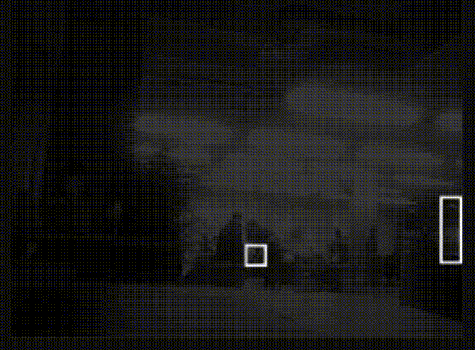
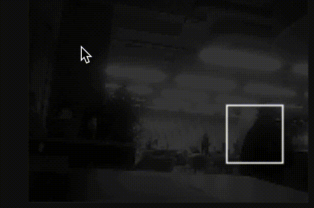
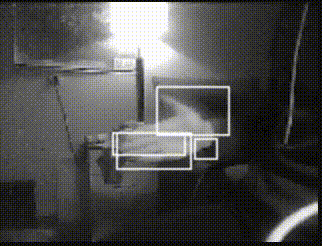

# ESP32: Detect movements

Detect movements on ESP32 using camera

<p align="center">
    
</p>


## Team

Mentors:

- Danylo Sahaidak
- Bohdan Yavorivskiy

Members:

- Dmytro Shumskyi
- Yurii Sahaidak
- Marta Samoilenko
- Victor Muryn

## Used components

- Board: ESP32-CAM

You can use any other ESP32 and Camera Module which is supported with esp32-camera library. Also ESP32 should have a PSRAM. To use other module change pins in *components/Camera.config.h*. Some of modules are already supported in this file (ESP32-CAM, ESP-EYE).

## Installation

Project uses esp32-camera library, so use this command to install library.

```bash
git clone --recursive git@github.com:hellcastter/esp32-move-detect.git
```

Also you need to install esp-idf of version 4.4. You can find instructions [here](https://docs.espressif.com/projects/esp-idf/en/release-v4.4/esp32/get-started/index.html).

## Settings

Open *components/Camera.config.h* and change settings to your own. You could change wifi credentials in file *components/WifiCredits.c*. Also, you might find useful to change settings in *components/Camera.h*. More about camera settings you can find [here](https://github.com/espressif/esp32-camera).

Also, do not forget to turn on PSRAM in *idf.py menuconfig*. Go to *Component config -> ESP32-specific -> Support for external, SPI-connected RAM* and turn it on.

## Upload

After that you are ready to go. Build and flash code to your board using interface of Esp-IDF in VS Code
or use command line interface of idf.py in your terminal.

```bash
idf.py build
idf.py -p PORT flash
idf.py monitor
```

## Usage

In you terminal you will find IP address of your board. Open it in your browser. If you see only black screen, try to change settings in *components/Camera.config.h*.

There are 7 urls you can go:

- / - just video from the camera.

- /simple - simple detection of movements
- /simpleBox - simple detection of movements. Also draws a box around the detected object.

- /average - average detection of movements (takes n frames and calculates average)
- /averageBox - average detection of movements (takes n frames and calculates average). Also draws a box around the detected object.

- /median - median detection of movements (takes n frames and calculates median)
- /medianBox - median detection of movements (takes n frames and calculates median). Also draws a box around the detected object.

## Examples

<p align="center">
    
</p>

<p align="center">
    
</p>

<p align="center">
    
</p>

## Additional information

Some more information you could find [here](https://www.overleaf.com/read/vbmnwngxpxhp#0fb4d9) and [here](https://www.canva.com/design/DAF4Kgk4rFQ/3g4ogLKe2gLSv7kS-HdqwA/view).
